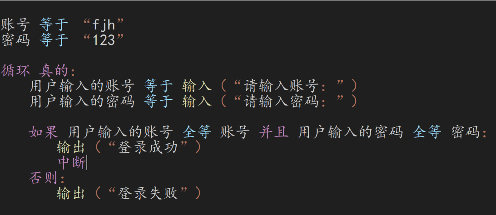
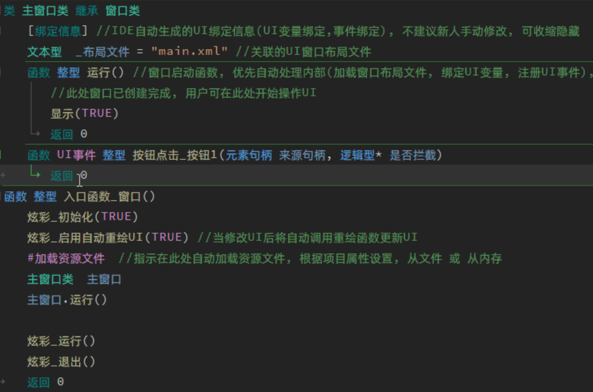
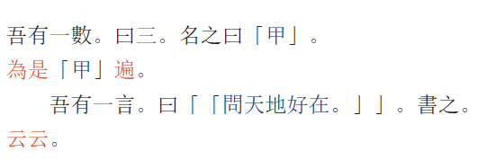
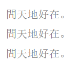

# 中文编程语言介绍
很多学生都说自己英文不好，所以学不会编程。但是有没有想过世界上有很多中文编程语言呢，下面是我知道的一些中文编程语言（或者是其他语言魔改），我们来一起看看吧。

## 熊猫编辑器

[熊猫编辑器](https://cxfjh.github.io/) ，语法是 Python 的语法，但全都是用中文来写的。

有兴趣的可以从网盘下载并安装使用 [下载链接](https://www.123pan.com/s/IzrNjv-cAd7A)

## 炫语言

[炫语言中文编程](http://xc.xcgui.com/)

这个也是中文编程，可以做界面，但是好像要收钱。。。

## 文言

[文言](https://wy-lang.org/) 是一个文言文的编程语言，代码风格长这样：

上面代码翻译过来就是：把 問天地好在。循环三遍

这个 [网站](https://ide.wy-lang.org/) 有很多例子，但是阅读起来贼难受。

如果古人写代码，就是这样啊~