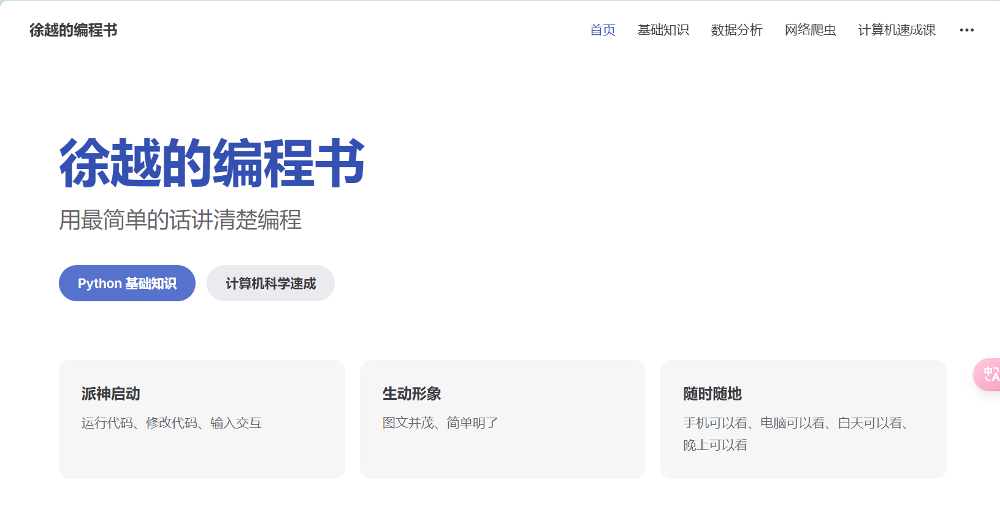

# 本网站的使用说明



本网站 [https://book.xuyue.cc](https://book.xuyue.cc) 是一本编程书，其中包含了编程语言、应用领域、计算机科学等相关内容。

本网站支持代码互动，比如下面的代码区，在输入框输入**黄岩一职**，点击运行，会显示欢迎光临：

<script lang="ts" setup>
const code = `
a=input()
if a == "黄岩一职":
    print("欢迎光临")
`
</script>

<editor :code="code" />

当然普通的、不互动的代码块也有，一般用于演示：

```python
print("欢迎光临")
```

我大部分的有图文的内容都会放在飞书知识库中，由于学校机房孱弱的机器性能，这个网站仅是一些必要的文字，以满足上课时候的需求。

一般来说，这个网站的内容会以链接的形式放到我的其他网站上去，能直接翻看这个网站的人算是少数吧（笑
