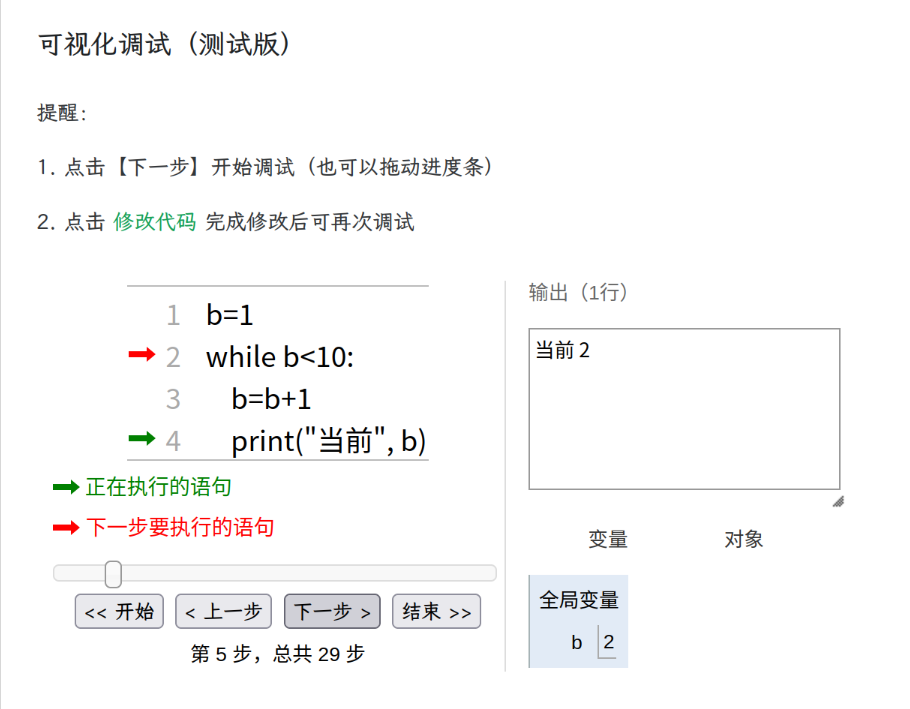

# 自测猫的使用说明

自测猫 [https://code.xuyue.cc](https://code.xuyue.cc) 是一个代码在线运行的网站，省去在本地搭建编程环境的过程，平时运行简单的代码片段够用了。（为什么叫自测猫，因为是**自**行**测**试代码的机器**猫**

在左边写代码，当遇到要输入的情况时，在右侧上方的输入框中先写好你要输入的内容，再点击右上角绿色的运行（或者快捷键 F5），运行结果就会出现在下面。

因为适配了移动端，用手机打开，一些功能我给移到其他地方了，并且新增了**编程助手**，方便关键字和符号的输入：

希望不要给我找没有电脑的借口了，你有手机就可以写代码了（也许吧

对了，自测猫支持**实时保存**，不小心关掉页面，你写的代码也不会丢失。

在写 Python 代码的时候，可以点击红色的【调试】按钮，进入调试界面。

1. 点击【下一步】可以看到代码下一步执行到哪里，绿色箭头表示正在执行的语句，红色箭头表示下一步将要执行的语句；

2. 可以点击【上一步】退回到上一步；

3. 右侧可以看到输出结果和变量的值。