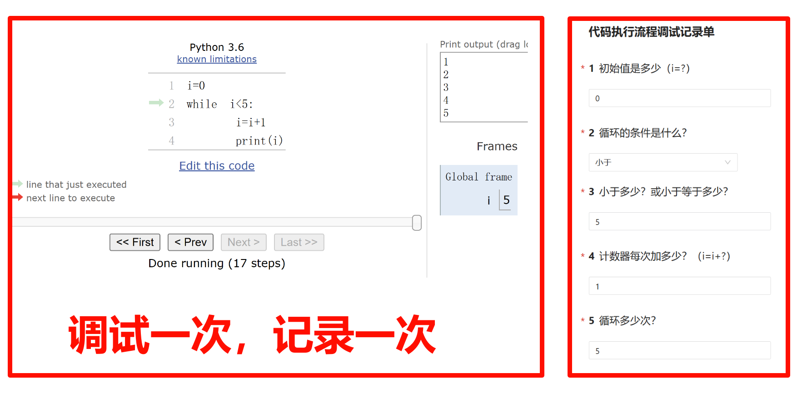
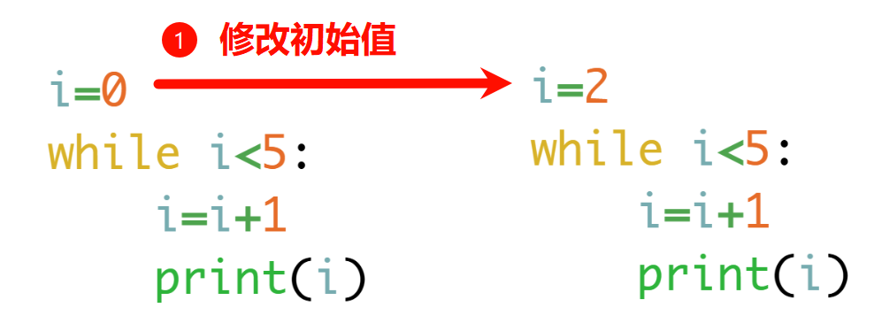
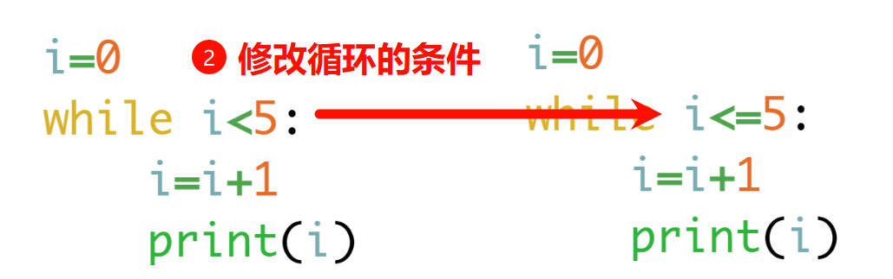
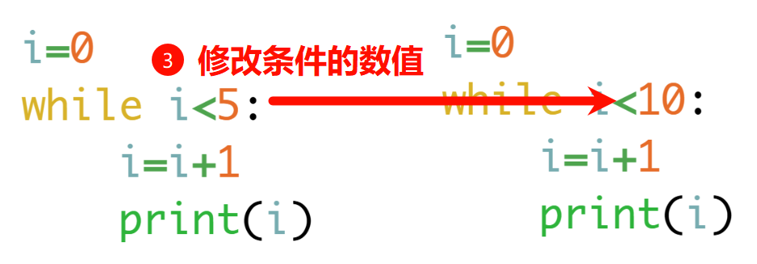
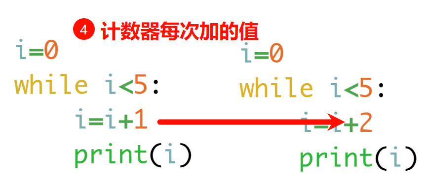
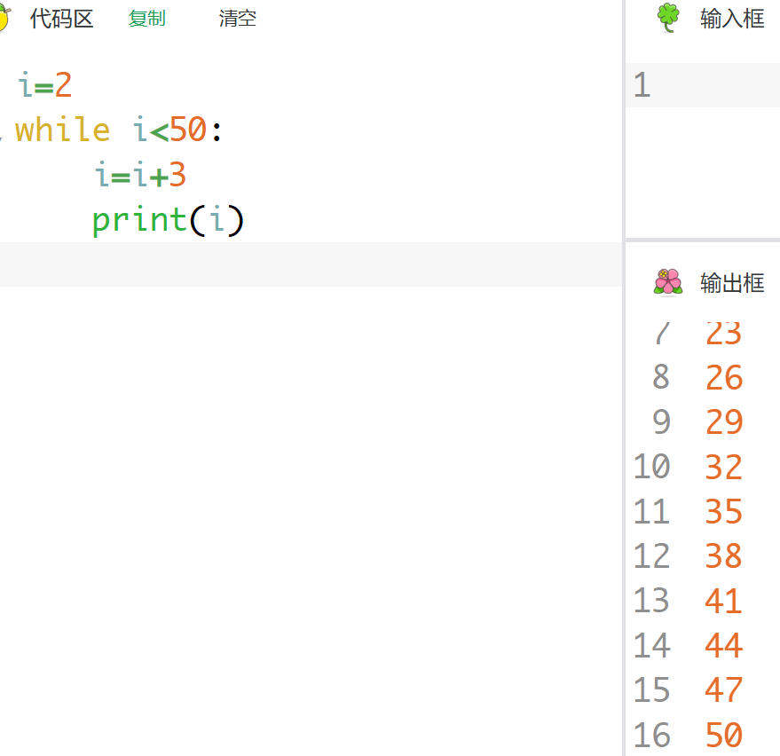

# 调试并记录

## [完成自学](/basic/tips/pythontutor/)

现在需要记录每次的调试过程，分别需要记录：

1. 初始值

2. 循环的条件

3. 条件的值

4. 计数器每次加的值

5. 循环的次数

每一项所对应的代码，如图：

每次填写后，刷新网页再次填写。

打开：[https://lc.xuyue.cc/public-forms/do0zqi0xlpe](https://lc.xuyue.cc/public-forms/do0zqi0xlpe)

## 第一步 两人一组，一人负责调试，一人负责记录

## 第二步 修改一次代码，调试并记录

你可以选择以下其中一种，修改代码，调试并记录。

1. 修改初始值，举个例子，从初始值 0 改为 2

2. 修改循环的条件，举个例子，从小于改为小于等于

3. 修改条件的数值，举个例子，从 5 改为 10

4. 修改计数器每次加的数，举个例子，从 1 改为 2

## 第三步 在自测猫中修改代码，记录

打开：[https://code.xuyue.cc/?query=5](https://code.xuyue.cc/?query=5)

每次修改【初始值、循环的条件、条件的值、计数器每次加的值】，运行查看循环次数，并记录。

比如：

每组至少记录 5 份。
