# 使用 [pythontutor.com](https://pythontutor.com/) 可视化的执行流程

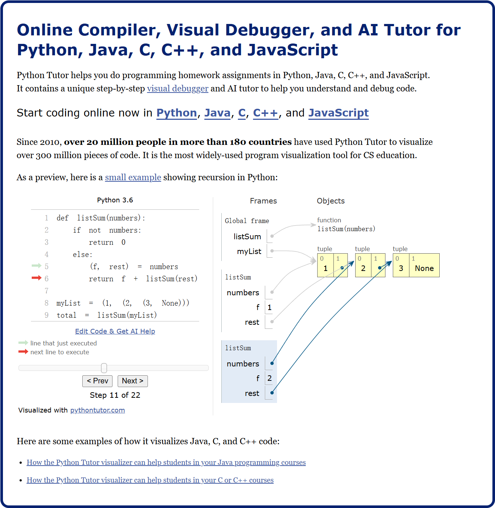

由于网站都是英文的，所以接下来我会一步步的截图，请按照顺序执行

## 1. 选择编程语言

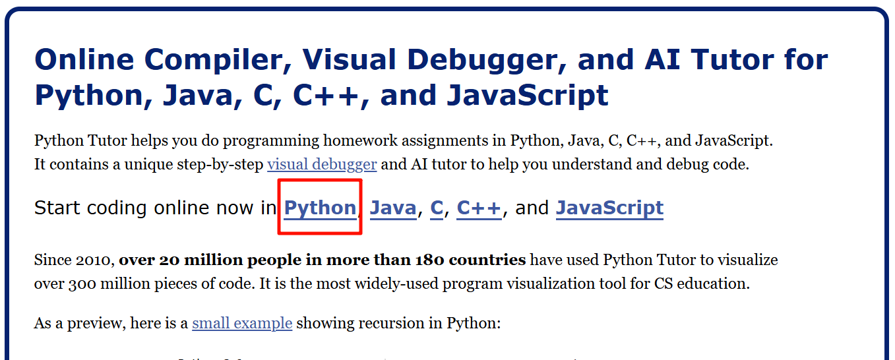

## 2. 在输入框中粘贴代码


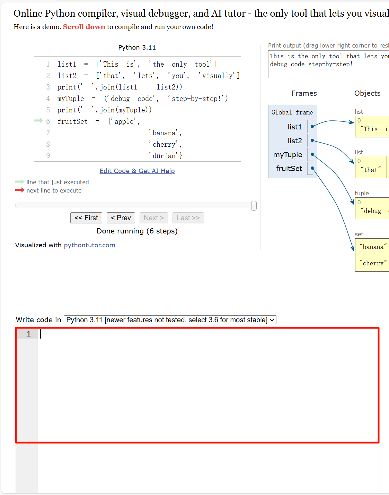

```py
n=1
i=0
while i<5:
    i=i+1
    n=n*2
    print(n)
```

## 3. 点击【可视化执行】按钮

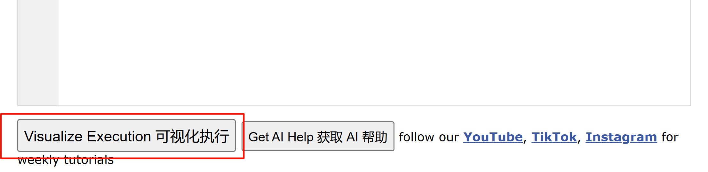

## 4. 进入调试页面

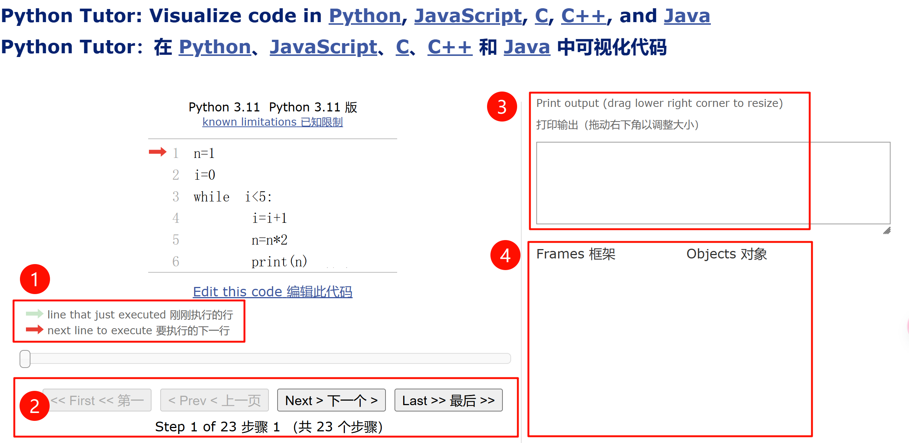

① 绿色箭头表示【当前正在】执行的语句

② 红色箭头表示【接下来要】执行的语句

③ 输出结果

④ 显示变量的值

## 5. 基础调试

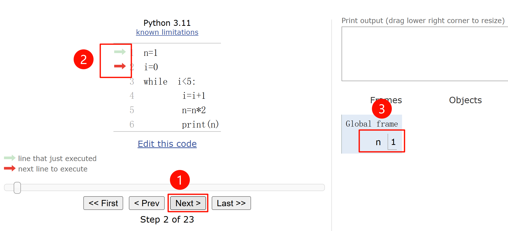

5.1 不断点击 ①【Next 下一步】按钮

5.2 代码左侧 ② 出现绿色和红色箭头，指向【当前】和【接下来】的执行语句。

5.3 右侧 ③ 实时展示变量的值

**注意观察箭头的走向和变量值的变化**

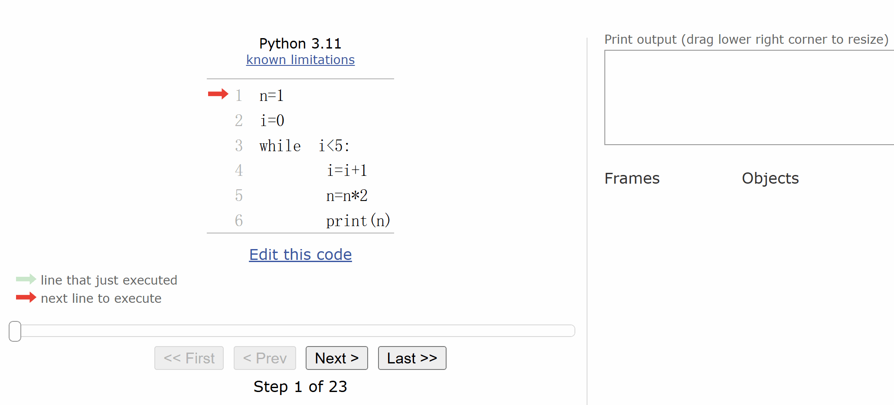

## 6. 拖动进度条 *

可以拖动进度条反复查看，或者点击【First】跳到第一步，【Last】直接跳到最后一步

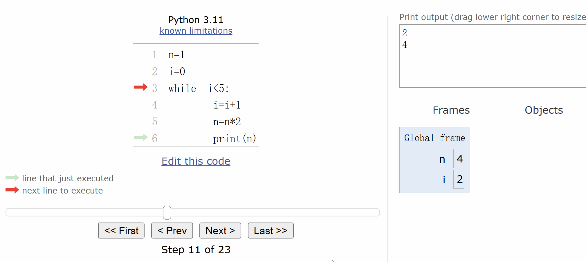

## 7. 更改代码再次调试

点击【Edit this code】按钮可以修改代码


**可以更改 i 的初始值 i=?，条件符号，条件值，计数器 i=i+? 等**

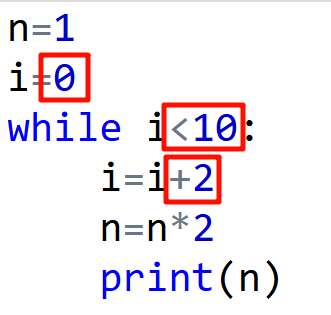

比如：

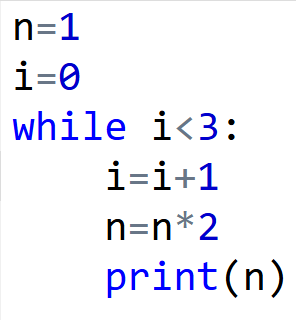

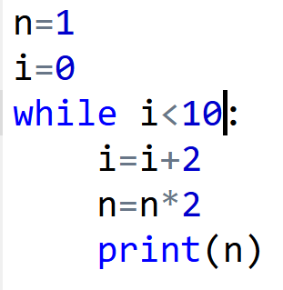

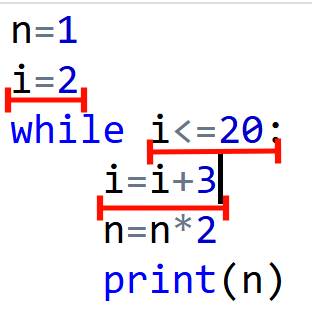

遇到弹框，直接点按钮

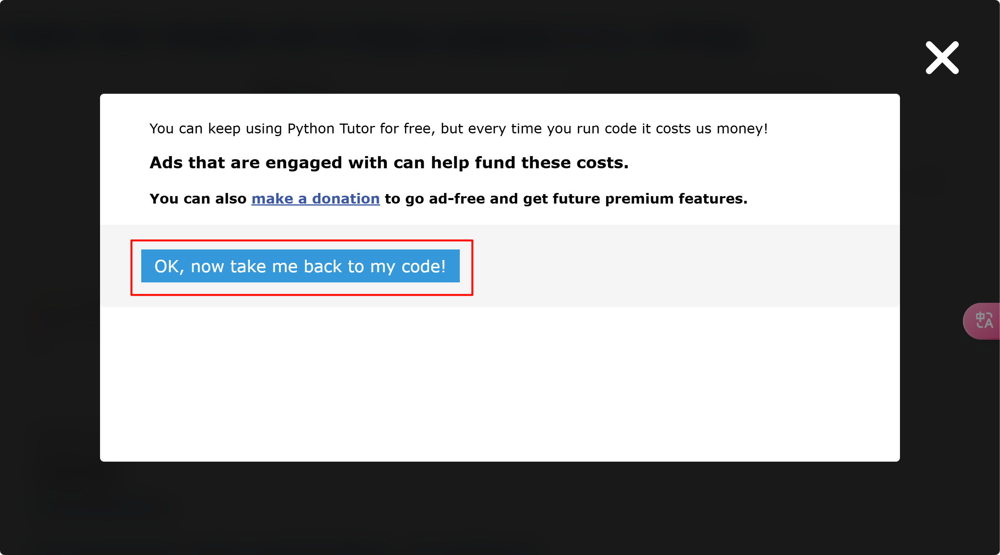
