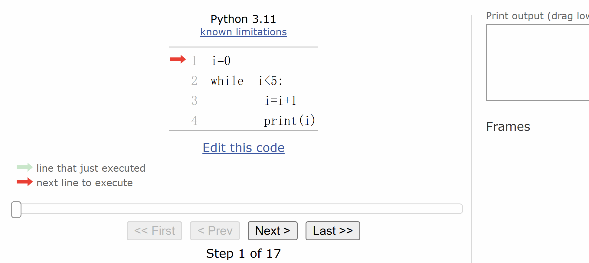
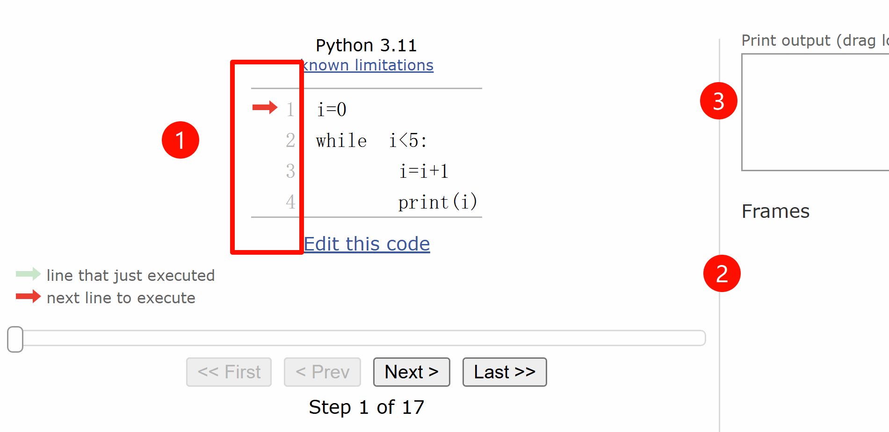
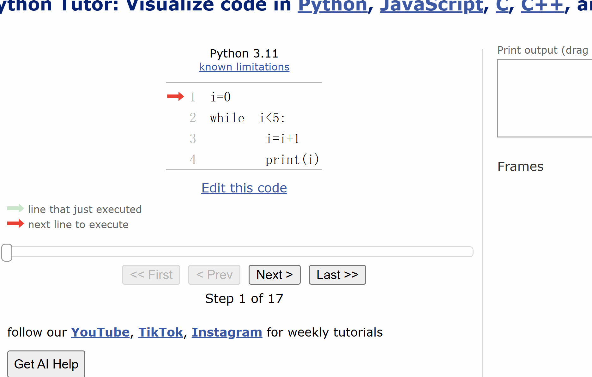

# 可视化执行流程

如图演示，我们可以精确控制代码的执行流程。



打开 [pythontutor.com](https://pythontutor.com/)，由于网站都是英文的，所以接下来我会一步步的截图，请按照顺序执行。

## 第一步 选择编程语言


## 第二步 在输入框中粘贴代码


```py
i=0
while i<5:
    i=i+1
    print(i)
```

## 第三步 点击【可视化执行】按钮


## 第四步 进入调试页面


① 点击下一步

② 绿色箭头表示【当前正在】执行的语句，红色箭头表示【下一步要】执行的语句

③ 显示变量的值

④ 输出的内容

## 第五步 调试代码



5.1 不断点击【Next】按钮

5.2 ① 注意【绿色】和【红色】箭头的走动

5.3 ② 变量的值随着代码的执行而发生变化

5.4 ③ 输出内容的变化

**注意观察箭头的行走和值的变化**

## 第六步 更改代码再次调试

点击【Edit this code】按钮可以修改代码



遇到弹框，直接点按钮


## [完成任务](/basic/tasks/pythontutor/)