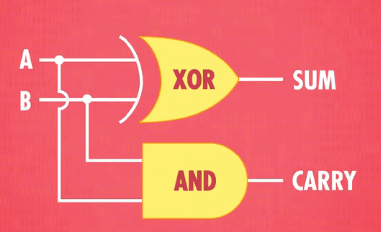
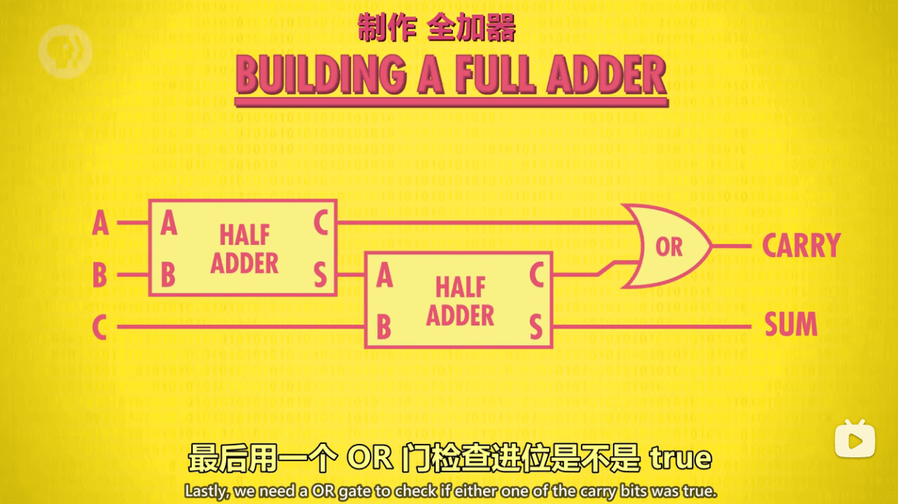
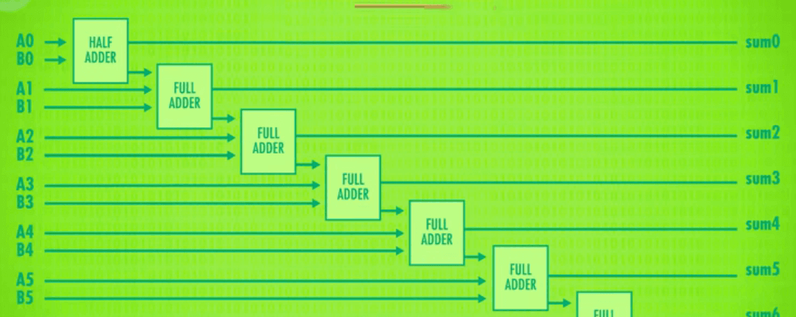
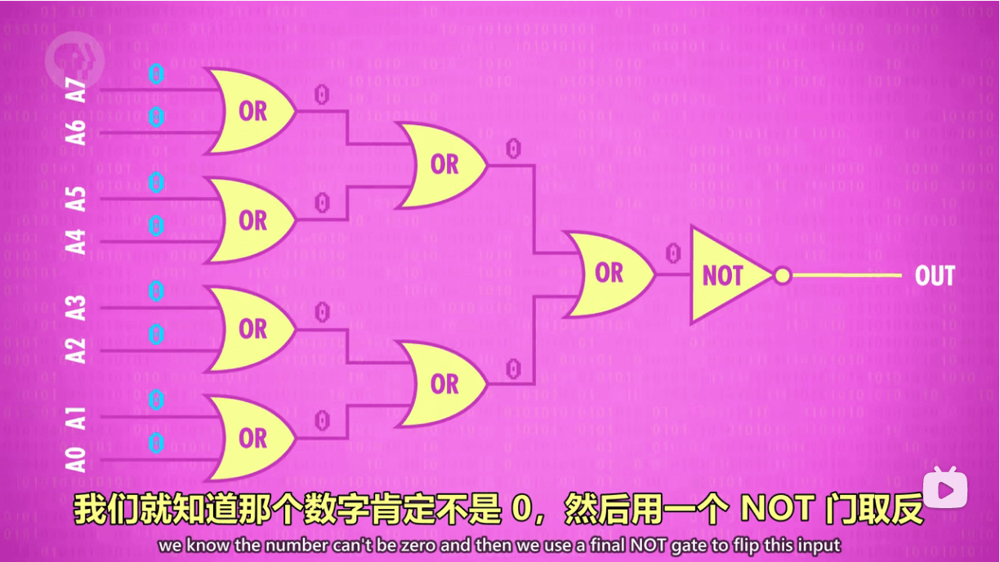
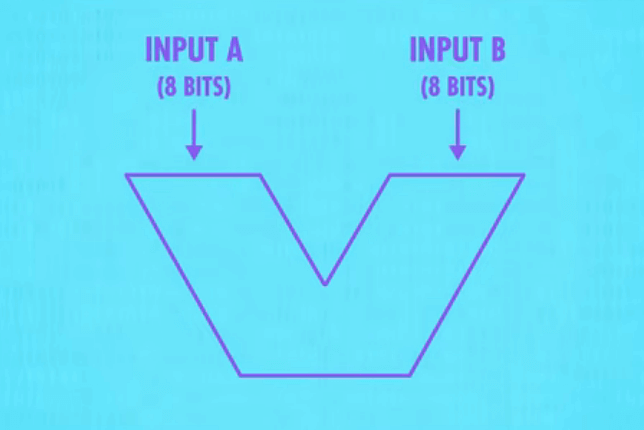

# 算术逻辑单元

<author name="李云豪" title="21 计算机 3 班"/>

:::tip
[前去观看第五集](https://bilibili.com/BV1EW411u7th?p=5)
:::

## 什么是 ALU

上一节课我们提到如何用二进制表示数据，如 010 表示 2 等。我们知道，**表示和存储数据**是计算机的重要功能。但真正的目标是计算处理有意义的数据，这些操作由计算机的“算术逻辑单元”处理，简称 ALU。

ALU 有 2 个单元：**算数单元**和**逻辑单元**

## 算数单元

它负责计算机里所有的数字操作，比如加减法，或者给某个数+1（这个叫增量运算），不过今天我们重点要理解的是加法运算。

设计时，我们不在晶体管层次出发，而是用更高层的抽象 —— **逻辑门**。我们需要用到 AND，OR，NOT 和 XOR 逻辑门。

### 半加器

对于二进制加法，1+0=1，0+1=1，0+0=0，1+1=10。如下图：

因为 XOR 门只能存放 1 bit 所以当计算 1+1 时，我们需要一根额外的线代表"进位"

AND 门，只有当两个输出的结果都为 TRUE 时则为 TRUE

它只能处理一位计算，我们称为**半加器**

### 全加器

如果想要处理超过 1+1 的运算，我们需要**全加器**。

半加器输出了进位，着意味着，我们处理时，还需要将进位考虑进去，才能设计全加器。

全加器要考虑三位数字的和，全加器有三输入（这里是 A B C），两输出（进位和总和）。"总和"和"进位"要两条输出线

先用半加器将 A 和 B 相加 然后把 C 输入到第二个半加器 最后用一个 OR 门检查进位是不是 TRUE

### 8 位加法器

全加器会把 A B C 三个输入加起来输出"总和"和"进位"

有了全加器，我们可以进行多位加法器设计。这主要是利用半加器和全加器进行，刚开始因为没有高位的进位，我们使用半加器，接下来我们全部使用全加器，因为需要考虑进位。

下图是相加两个 8 位数字

第 1 次数字相加 无进位 所以用一个半加器 之后每一个进位用全加器来表示（以此类推）

### 溢出怎么办？

两者数字太大了 超过了用来表示的位数 比如 8 位加法器的第 9 位糖豆人的 BUG

可以通过扩大表示位数来减少溢出（缺点是会用到更多逻辑门且每次的进位都需要时间），所以，现代电路用的加法器不同，叫**超前进位加法器**。

## 逻辑单元

逻辑单元执行逻辑操作 比如 AND OR NOT

### 检测数字是否为 0 的电路

例如下图就是检查 ALU 输出是不是 0 的电路，很简单，多个或操作，然后最后取反便可，因为只有输出位数全为 0，结果才为 0。

## 一个抽象的 ALU 的执行过程

### 1. 输入

两个输入 A 和 B，都是 8 位的

### 2. 操作码

还需要告诉 ALU 执行什么操作，例如加法或者减法，所以用 4 位操作代码 简而言之："1000"可能代表加法命令，"1100"代表减法命令

### 3. 输出

输出结果还是 8 位的，ALU 还输出一堆标志（Flag）。一些操作介绍如下：

#### 标志（Flag）

- ZERO：若 ALU 输出是 0，那么 ZERO 标志就变成 1。
- NEGATIVE：我们可以用 ALU 做减法，然后用 NEGATIVE 判断其是不是小于 0，从而进行比较大小。
- OVERFLOW：ALU 还有溢出单元，判断有没有进位。

ALU 有很多 Flag，这三个是最常用的。

## 接下来

现在，我们知道了计算机是怎样在没有齿轮或者杠杆的情况下进行运算的，接下来，我们讲如何利用 ALU 做一个 CPU。
