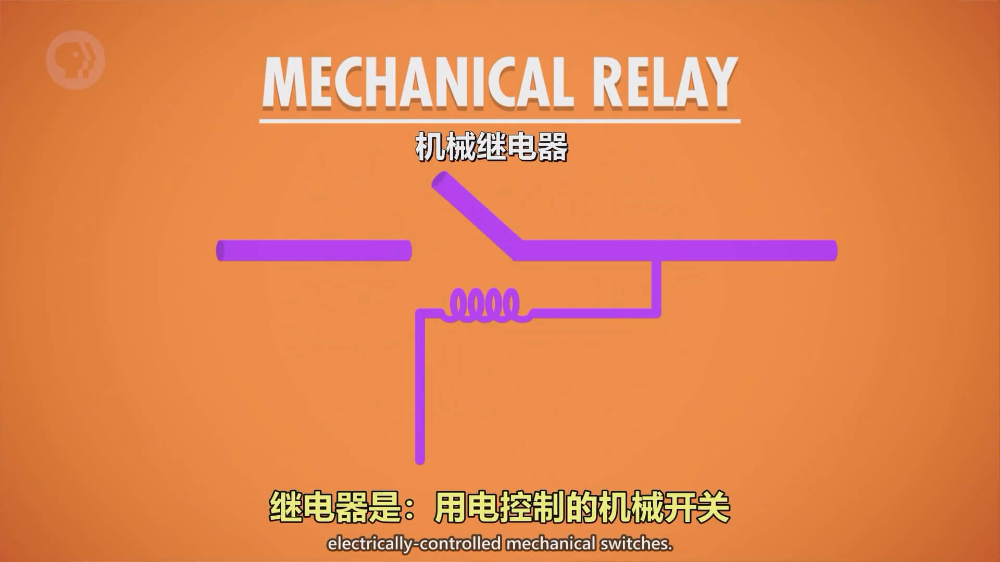
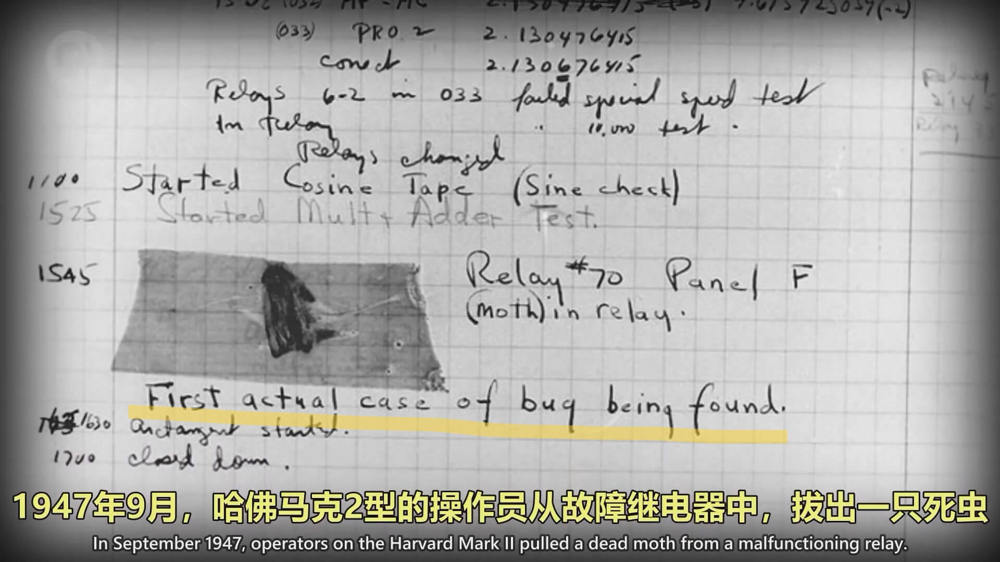
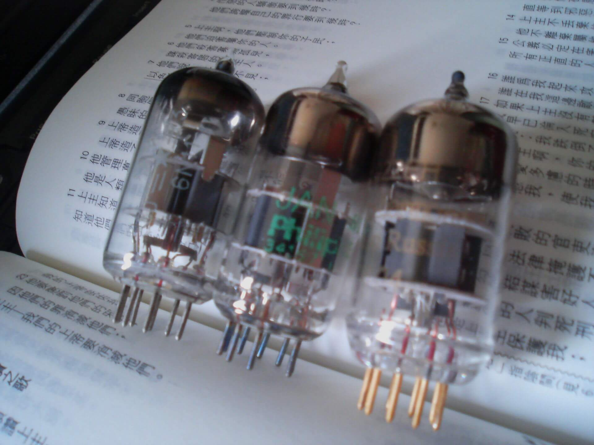
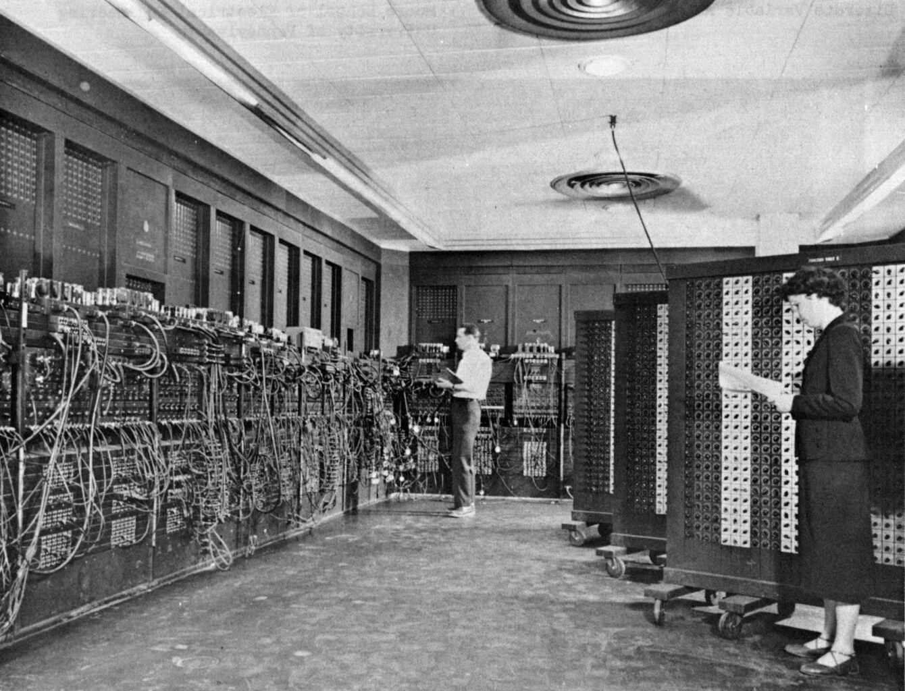
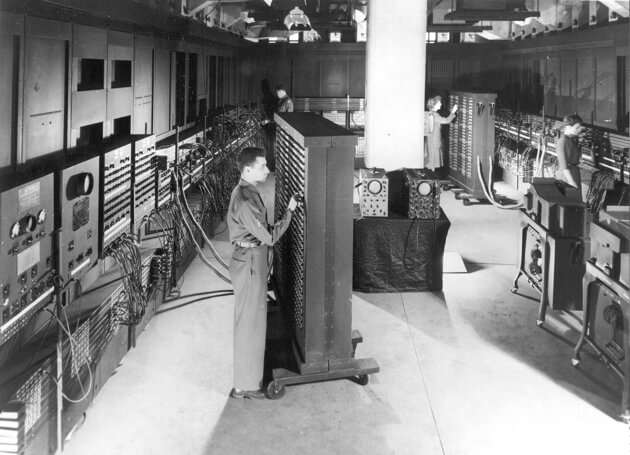
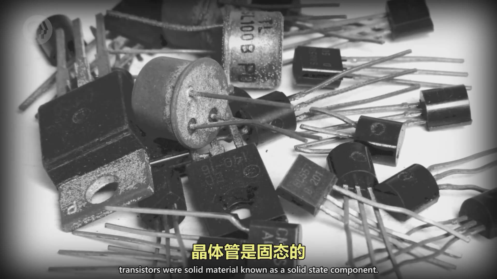
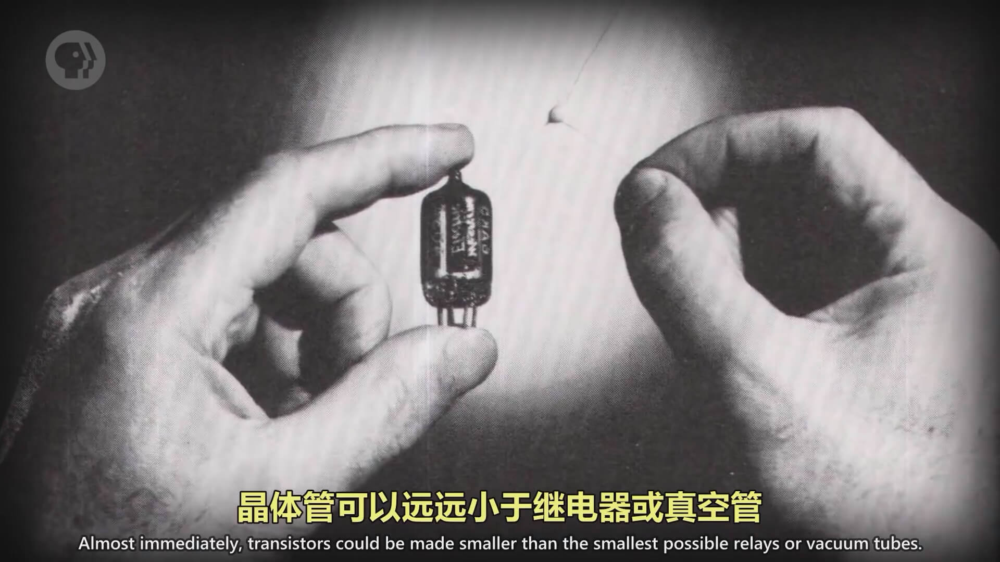
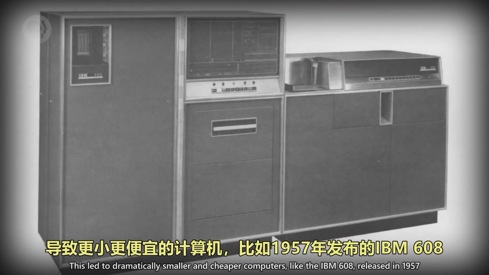

# 电子计算机

:::tip
[前去观看第二集](https://bilibili.com/BV1EW411u7th?p=2)
:::

20 世纪人口暴增，科学与工程进步迅速，航天计划成形。以上导致数据的复杂度急剧上升、计算量暴增，对于计算的自动化、高速有迫切的需求。

## 继电器

1944 年 IBM 建造的**哈佛马克一号**是当时最大的机电计算机，体积非常巨大，这台机器是为了给「曼哈顿计划」跑模拟数据的，它拥有大约 3500 个**继电器**。

继电器是用电控制的机械开关。继电器有根「控制线路」，控制电路是开还是关。当螺线圈通过电时，其会产生磁场，吸引上面的线闭合，达到连通的目的。这个继电器可以用于机器进行控制。

糟糕的是，继电器开关有一定质量，这会影响其闭合。其一秒能够闭合 50 次，导致计算机的运算非常慢。

:::info
哈佛马克一号 1 秒能做 3 次加减运算，1 次乘法要 6 秒，除法要 15 秒，更复杂的操作，比如三角函数，可能要一分钟以上。
:::

除了速度慢，另一个限制是齿轮磨损。随着机器的不断运行，机械器件的磨损不可避免

:::info
哈佛马克一号的任何一个继电器发生故障，就会导致计算出错，而一个计算可能耗时好几天，这是非常致命的。
:::

此外，巨大、黑色、温暖的机器也会吸引虫子。虫子的英文是 Bug。虫子附着在大型计算机的组件上，会导致其运行出错。那么，机器故障（Bug）的来源也是此。

要进一步提高计算能力，我们需要更快更可靠的东西来替代继电器

## 电子管

一个新的电子组件出现了 —— 「热电子管」。这种电子管只能运行电流**单向运动**，当电流反向时，电子管不能发光。这种管叫「二极管」。

但是我们需要的是一个可以控制开和关的元件，在 1906 年美国的李·德弗雷斯特在二极管中的两个电极之间加入了第三个控制电极，从而发明了**真空三极管**，真空三极管和继电器有着相同的功能，但是由于没有机械部件的物理移动，所以它的磨损很少，开闭速度可以达到每秒上千次。

真空三极管在无线电、长途电话等电子设备中大量运用，持续了近半个世纪。

刚开始时，这种三极管造价昂贵，而且一个计算机需要上千个电气开关。不过随着时间推移，一些政府部门可以承担这个价格。这标志着计算机从机电转向电子。

:::info
第一个大规模使用真空管的计算机是 1943 年的「巨人一号」，用于破解纳粹通信，它有 1600 个真空管，被认为是第一个可编程的电子计算机，编程方法是把几百根电线插入插板，但是需要**特别的**配置。
:::

## 电子计算机

世界上第一个真正的通用的可编程计算机是 ENIAC（电子数值积分计算机）。1946 年在美国宾夕法尼亚大学建造成功。ENIAC 每秒可执行 5000 次加减法，不过由于真空管很多，它几乎半天就会出现一次故障。

ENIAC（埃尼阿克）是世界上**第一台**通用计算机，和一个房间一样大。

ENIAC 的四个面板和一个函数表

## 晶体管

为了降低成本和大小，同时提高可靠性和速度，我们需要一种新的电子开关。1947 年，贝尔实验室发明了**晶体管**（晶体三极管），一个全新的计算机时代来临了。

晶体管有两端电极叫做「源极」和「漏极」，中间的材料叫「栅极」，栅极使用半导体材料（有时候导电，有时候绝缘）

晶体管每秒开关一万次，相比较体型巨大且玻璃易碎的真空管，固态的晶体管占尽优势。

固体管和晶体管大小的比较

由于晶体管的体积很小而且价格便宜，这样我们就能制造出更小更便宜的计算机。

1957 年发布的 IBM 608 是第一款完全使用晶体管且消费者可以买到的计算机，它有 3000 个晶体管，每秒可以执行 4500 次加减法、80 次的乘除法

如今，晶体管小至几十纳米，运算次数达到几十上百万，并且有几十年的寿命。

## 接下来

从继电器到电子管到晶体管，计算机的体积越变越小，速度越变越快，如何利用晶体管进行计算呢？
